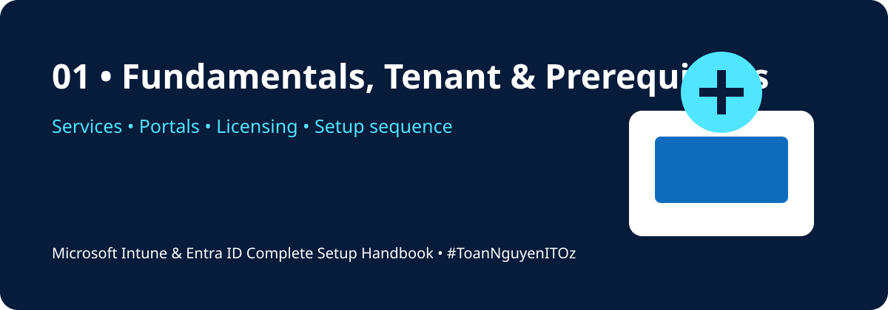
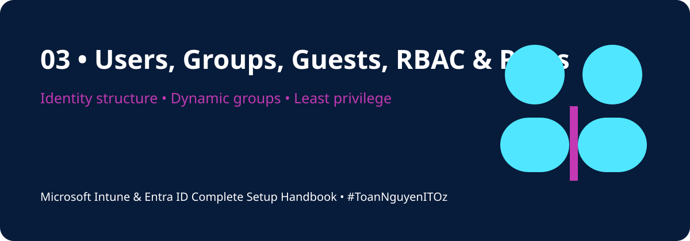
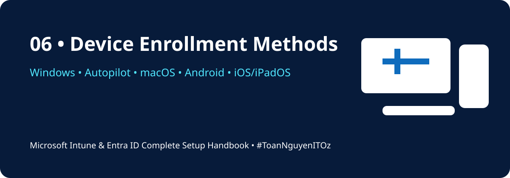
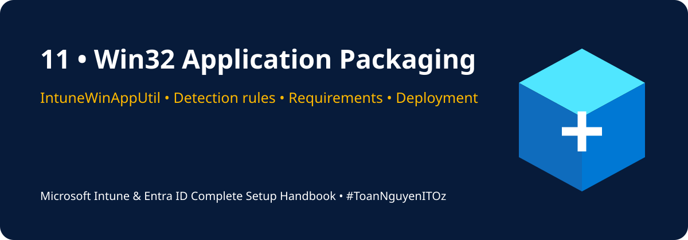

<div align="center">


# ☁️ Microsoft Intune & Entra ID Complete Setup Handbook

### A practical, lab-driven guide for building, securing, managing, and troubleshooting a modern Microsoft cloud environment

[](https://learn.microsoft.com/mem/intune/)
[](https://learn.microsoft.com/entra/identity/)
[](https://learn.microsoft.com/microsoft-365/)
[](https://www.microsoft.com/windows/)
[](https://learn.microsoft.com/powershell/)
[](#-learning-path)
[](#-roadmap)
[](LICENSE)

**Plan → Configure → Enrol → Secure → Deploy → Monitor → Troubleshoot → Improve**

</div>

---

## 📘 About This Repository

This repository is a complete Microsoft Intune and Microsoft Entra ID learning handbook designed for IT Support, Service Desk, Endpoint, Modern Workplace, Microsoft 365, and Systems Administration professionals.

The content follows a logical tenant-to-production sequence and includes portal paths, implementation checklists, PowerShell examples, lab exercises, troubleshooting workflows, and production-readiness guidance.

> [!IMPORTANT]
> Test all policies in a dedicated pilot group before broad production deployment. Conditional Access, compliance, enrollment restrictions, and application assignments can lock out users or disrupt business operations when configured incorrectly.

---

## 🧭 Learning Path

| Phase | Topic | Outcome |
|---|---|---|
| 1 | Fundamentals and tenant prerequisites | Understand services, portals, licensing, and setup order |
| 2 | Domains, identities, users, groups, and roles | Build the identity foundation |
| 3 | Authentication and hybrid identity | Configure MFA, SSPR, Entra Join, PHS, SSO, and Entra Connect |
| 4 | Intune activation and enrollment | Enable MDM and enrol corporate or BYOD devices |
| 5 | Configuration, compliance, and security | Apply settings, compliance, Conditional Access, and endpoint protection |
| 6 | Applications, scripts, and updates | Deploy apps, Win32 packages, remediation scripts, and Windows updates |
| 7 | Reporting and troubleshooting | Investigate failed deployments, enrollment issues, and policy conflicts |
| 8 | Production readiness | Validate the environment before go-live |

---

## 📚 Table of Contents

### Core Handbook

1. [🏢 Fundamentals, Tenant & Prerequisites](docs/01-fundamentals-tenant-prerequisites.md)
2. [🌐 Custom Domain & License Assignment](docs/02-custom-domain-licensing.md)
3. [👥 Users, Groups, Guests, RBAC & Roles](docs/03-users-groups-guests-rbac.md)
4. [🔐 MFA, SSPR, Join, Connect, PHS, SSO & ADFS](docs/04-identity-authentication-hybrid.md)
5. [⚙️ Intune Activation, Auto Enrollment & Restrictions](docs/05-intune-activation-enrollment.md)
6. [💻 Device Enrollment Methods](docs/06-device-enrollment-methods.md)
7. [🛡️ Compliance, Configuration, Conditional Access & Endpoint Security](docs/07-compliance-configuration-security.md)
8. [📦 Apps, Updates, Reporting & Troubleshooting](docs/08-apps-updates-reporting.md)
9. [✅ Final Production Readiness Checklist](docs/09-final-readiness-checklist.md)

### Extended Practical Modules

- [🚀 Windows Autopilot Deployment](docs/10-windows-autopilot.md)
- [📦 Win32 Application Packaging](docs/11-win32-app-packaging.md)
- [🧰 Troubleshooting Playbook](docs/12-troubleshooting-playbook.md)
- [🧪 Hands-on Lab Scenarios](labs/README.md)
- [⚡ PowerShell Scripts](scripts/README.md)
- [📋 Reusable Templates](templates/README.md)

---

## 🖼️ Visual Handbook

| Section | Illustration |
|---|---|
| 01 — Fundamentals |  |
| 02 — Domain & Licensing |  |
| 03 — Users, Groups & RBAC |  |
| 04 — Identity & Authentication |  |
| 05 — Intune Activation |  |
| 06 — Device Enrollment |  |
| 07 — Compliance & Security |  |
| 08 — Apps, Updates & Reporting |  |
| 09 — Production Readiness |  |
| 10 — Windows Autopilot |  |
| 11 — Win32 App Packaging |  |
| 12 — Troubleshooting |  |

---

## 🏗️ Recommended Setup Flow

```text
Tenant → Custom Domain → Licensing → Users and Groups → RBAC
→ MFA and SSPR → Intune Activation → Enrollment Configuration
→ Device Enrollment → Configuration Profiles → Compliance Policies
→ Conditional Access → Endpoint Security → Apps and Updates
→ Reporting and Troubleshooting
```

---

## 🧰 Required Admin Portals

| Portal | Primary Purpose |
|---|---|
| Microsoft 365 Admin Center | Tenant, users, licences, domains, service health |
| Microsoft Entra Admin Center | Identity, authentication, roles, groups, Conditional Access |
| Microsoft Intune Admin Center | Devices, apps, policies, enrollment, reports |
| Microsoft Defender Portal | Endpoint security, incidents, vulnerabilities, security posture |
| Microsoft Purview Portal | Compliance, information protection, audit, retention |

---

## 🧪 Lab Environment Recommendation

```text
1 x Microsoft 365 Developer or trial tenant
1 x Global Administrator emergency account
1 x Intune Administrator account
1 x Standard test user
1 x Pilot user group
1 x Windows 11 virtual machine
1 x Android or iOS test device
Optional: Windows Server domain controller for hybrid labs
```

### Suggested Test Groups

```text
GRP-Intune-Licensed-Users
GRP-Intune-Pilot-Users
GRP-Intune-Windows-Devices
GRP-Intune-App-Deployment
GRP-Update-Ring-Pilot
GRP-Compliance-Pilot
GRP-Conditional-Access-Pilot
```

---

## 🔐 Security Principles

- Apply least privilege and separate daily admin from emergency access accounts.
- Require MFA for administrators and maintain at least two emergency access accounts.
- Use pilot groups before production rollout.
- Combine device compliance with Conditional Access.
- Prefer cloud-native management where practical.
- Document every production policy, assignment, exception, and rollback plan.
- Monitor sign-in logs, audit logs, deployment reports, and service health.

---

## 📂 Repository Structure

```text
microsoft-intune-entra-id-complete-handbook/
├── README.md
├── LICENSE
├── assets/images/               # Cover and section illustrations
├── docs/                        # 12 handbook modules
├── labs/README.md               # Hands-on lab scenarios
├── scripts/                     # PowerShell diagnostics
└── templates/                   # Reusable operational templates
```

---

## 🎯 Key Outcomes

After completing the handbook, you should be able to configure a tenant foundation, add a custom domain, manage identities and roles, secure authentication, enroll multiple device platforms, deploy policies and applications, manage Windows updates, troubleshoot failures, and validate production readiness.

---

## 🗺️ Roadmap

- [x] Core nine-part setup handbook
- [x] Windows Autopilot module
- [x] Win32 application packaging module
- [x] Troubleshooting playbook
- [x] PowerShell diagnostics starter scripts
- [x] Reusable operational templates
- [x] Visual cover and illustrations for all handbook modules
- [ ] Android Enterprise advanced scenarios
- [ ] Apple Automated Device Enrollment
- [ ] Microsoft Graph automation examples
- [ ] Endpoint Privilege Management
- [ ] Windows 365 and Cloud PC integration
- [ ] Intune Suite advanced capabilities

---

## 🤝 Contributions

Contributions, lab screenshots, corrections, and real-world troubleshooting cases are welcome. Please open an issue or submit a pull request with a clear description of the proposed change.

---

<div align="center">

## 👨‍💻 Author

**Xuan Toan Nguyen**  
IT Support · Systems Administration · Microsoft 365 · Azure · Modern Workplace  
📍 Adelaide, South Australia  
🏅 Silver Medalist — WorldSkills Australia SA Regional Competition 2026, Cloud Computing

[](https://www.linkedin.com/in/toan-nguyen-it-oz)
[](https://github.com/toannguyenitoz)

### ⭐ Support the Project

If this handbook is useful, please star the repository and share it with other IT professionals.

**#MicrosoftIntune · #MicrosoftEntraID · #Microsoft365 · #ModernWorkplace · #ToanNguyenITOz**

[⬆ Back to Top](#️-microsoft-intune--entra-id-complete-setup-handbook)

</div>