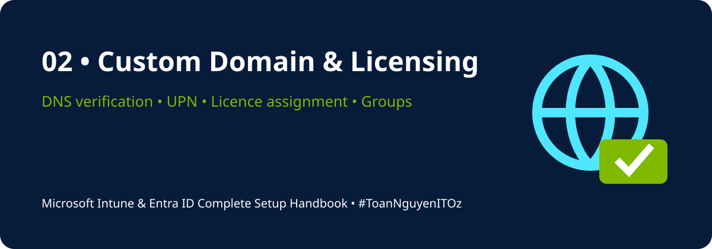

<!-- HANDBOOK-HEADER:START -->

[🏠 Handbook Home](../README.md) · [🧪 Labs](../labs/README.md) · [⚡ Scripts](../scripts/README.md) · [📋 Templates](../templates/README.md)

<!-- HANDBOOK-HEADER:END -->

# 🌐 Custom Domain & License Assignment

[⬅ Previous](01-fundamentals-tenant-prerequisites.md) · [🏠 Home](../README.md) · [Next ➡](03-users-groups-guests-rbac.md)

---

## Why Add a Custom Domain?

A custom domain gives users a professional sign-in identity such as `user@companyname.com`, improves identity consistency, and supports branded Microsoft 365 services.

## Add and Verify a Domain

1. Open **Microsoft 365 Admin Center**.
2. Go to **Settings → Domains → Add domain**.
3. Enter the domain name.
4. Copy the TXT verification record.
5. Add the record at the DNS hosting provider.
6. Return to Microsoft 365 and select **Verify**.
7. Add required DNS records for Exchange, Teams, and other services.
8. Set the domain as default when ready.
9. Update user UPNs in a controlled change window.

### Typical DNS records

| Record | Typical Purpose |
|---|---|
| TXT | Domain verification and SPF |
| MX | Email routing |
| CNAME | Service discovery |
| SRV | Teams or legacy service discovery |

> [!WARNING]
> Verify existing mail flow and DNS dependencies before changing MX or Autodiscover records.

## Licence Options

| Licence | Typical Coverage |
|---|---|
| Intune Plan 1 | MDM, MAM, compliance, app management |
| Microsoft 365 Business Premium | Office apps, Exchange, Teams, Entra ID P1, Intune |
| Microsoft 365 E3/E5 | Enterprise productivity, compliance, security, management |
| Entra ID P1/P2 | Conditional Access, SSPR, Identity Protection, PIM depending on plan |
| EMS E3/E5 | Identity, device management, and security suite |

## Assign a Licence to a User

1. Open **Microsoft 365 Admin Center**.
2. Go to **Users → Active users**.
3. Select the user.
4. Open **Licences and apps**.
5. Confirm the user's usage location.
6. Select the required licence.
7. Save changes.

## Group-Based Licensing

Recommended process:

1. Create a dedicated security group.
2. Add pilot users.
3. Open **Entra Admin Center → Billing → Licences**.
4. Select the product licence.
5. Choose **Licensed groups → Assign**.
6. Review assignment errors after propagation.

## Best Practices

- Use groups instead of direct licence assignment where possible.
- Create separate groups for pilot and production users.
- Document service plans disabled within a licence.
- Review licence consumption monthly.
- Never remove the original `onmicrosoft.com` domain; it remains part of the tenant.

## Validation Checklist

- [ ] Domain status is Healthy
- [ ] TXT verification completed
- [ ] Required DNS records validated
- [ ] Pilot user can sign in using new UPN
- [ ] Usage location configured
- [ ] Intune service plan enabled
- [ ] Group-based licensing errors reviewed

---

[⬅ Previous](01-fundamentals-tenant-prerequisites.md) · [🏠 Home](../README.md) · [Next ➡](03-users-groups-guests-rbac.md)

<!-- HANDBOOK-FOOTER:START -->
---

### 👨‍💻 Xuan Toan Nguyen

**IT Support · Systems Administration · Microsoft 365 · Azure · Modern Workplace**  
📍 Adelaide, South Australia  
🏅 Silver Medalist — WorldSkills Australia SA Regional Competition 2026, Cloud Computing

**#MicrosoftIntune · #MicrosoftEntraID · #Microsoft365 · #ModernWorkplace · #ToanNguyenITOz**

[⬆ Back to Top](#top) · [🏠 Back to Handbook](../README.md)

<!-- HANDBOOK-FOOTER:END -->
