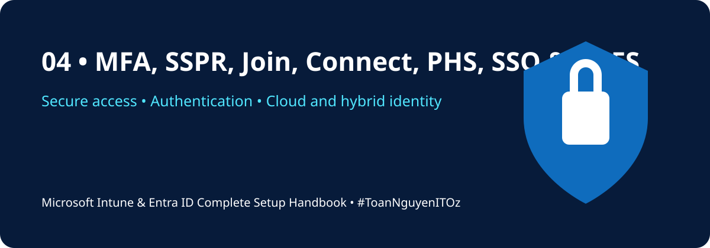

<!-- HANDBOOK-HEADER:START -->

[🏠 Handbook Home](../README.md) · [🧪 Labs](../labs/README.md) · [⚡ Scripts](../scripts/README.md) · [📋 Templates](../templates/README.md)

<!-- HANDBOOK-HEADER:END -->

# 🔐 MFA, SSPR, Join, Connect, PHS, SSO & ADFS

[⬅ Previous](03-users-groups-guests-rbac.md) · [🏠 Home](../README.md) · [Next ➡](05-intune-activation-enrollment.md)

---

## Multi-Factor Authentication

Recommended implementation:

1. Define approved authentication methods.
2. Register pilot users.
3. Create a Conditional Access policy in report-only mode.
4. Require MFA for administrators first.
5. Review sign-in impact.
6. Expand to users and high-risk applications.

## Self-Service Password Reset

**Portal path:** `Entra Admin Center → Protection → Password reset`

Configure scope, authentication methods, registration, notifications, and on-premises password writeback if hybrid identity is used.

## Identity Join Options

| Option | Best For | Identity Source |
|---|---|---|
| Entra registered | BYOD and personal devices | Cloud registration |
| Entra joined | Cloud-native corporate devices | Entra ID |
| Hybrid Entra joined | Existing domain-joined estates | AD DS + Entra ID |

## Entra Connect and Cloud Sync

Use these technologies to synchronize identities from on-premises Active Directory to Microsoft Entra ID.

### Password Hash Synchronization

- Synchronizes password hashes to Entra ID
- Simple and resilient for many organizations
- Supports cloud authentication
- Recommended unless a specific requirement dictates another method

### Pass-Through Authentication

- Validates passwords against on-premises agents
- Requires highly available agents
- Adds dependency on on-premises connectivity

### Federation / ADFS

- Supports specialized or legacy federation requirements
- Higher operational complexity
- Requires resilient infrastructure and certificate management
- Should be retained only where a clear business requirement exists

## Password Writeback

Password writeback allows cloud password reset events to update the on-premises Active Directory password. Confirm licensing, connectivity, permissions, and Entra Connect configuration.

## SSO Validation

- [ ] User can sign in to Microsoft 365
- [ ] MFA challenge occurs as expected
- [ ] SSPR registration completes
- [ ] Password reset works
- [ ] Hybrid user synchronizes correctly
- [ ] Sign-in logs show expected authentication method
- [ ] Emergency access process has been tested

> [!WARNING]
> Never deploy a tenant-wide Conditional Access block policy without exclusions, report-only testing, and a validated emergency access procedure.

---

[⬅ Previous](03-users-groups-guests-rbac.md) · [🏠 Home](../README.md) · [Next ➡](05-intune-activation-enrollment.md)

<!-- HANDBOOK-FOOTER:START -->
---

### 👨‍💻 Xuan Toan Nguyen

**IT Support · Systems Administration · Microsoft 365 · Azure · Modern Workplace**  
📍 Adelaide, South Australia  
🏅 Silver Medalist — WorldSkills Australia SA Regional Competition 2026, Cloud Computing

**#MicrosoftIntune · #MicrosoftEntraID · #Microsoft365 · #ModernWorkplace · #ToanNguyenITOz**

[⬆ Back to Top](#top) · [🏠 Back to Handbook](../README.md)

<!-- HANDBOOK-FOOTER:END -->
