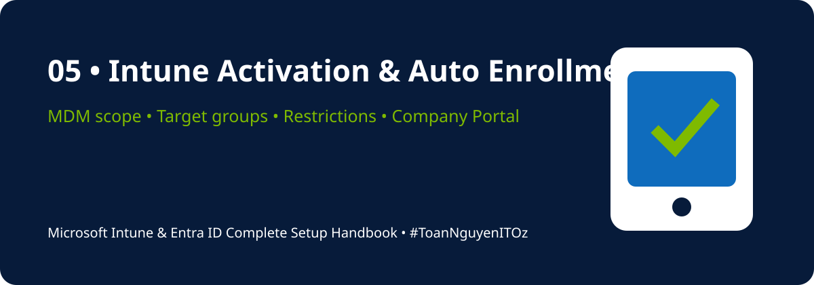

<!-- HANDBOOK-HEADER:START -->

[🏠 Handbook Home](../README.md) · [🧪 Labs](../labs/README.md) · [⚡ Scripts](../scripts/README.md) · [📋 Templates](../templates/README.md)

<!-- HANDBOOK-HEADER:END -->

# ⚙️ Intune Activation, Auto Enrollment & Restrictions

[⬅ Previous](04-identity-authentication-hybrid.md) · [🏠 Home](../README.md) · [Next ➡](06-device-enrollment-methods.md)

---

## Verify Tenant Status

1. Open **Microsoft Intune Admin Center**.
2. Go to **Tenant administration → Tenant status**.
3. Confirm the service is active.
4. Confirm Microsoft Intune is the MDM authority.
5. Review connector and service health information.

## Enable Automatic Enrollment

**Portal path:** `Devices → Enrollment → Windows → Automatic enrollment`

Configure:

- **MDM user scope:** Pilot group first, then All when validated
- **MAM user scope:** Configure only when app protection enrollment scenarios require it
- Default discovery and compliance URLs unless a documented design requires changes

## Create Target Groups

| Group | Purpose |
|---|---|
| Licensed Users | Users with Intune entitlement |
| Pilot Users | Controlled enrollment testing |
| Windows Devices | Windows policy targeting |
| Compliance Pilot | Compliance validation |
| App Deployment Pilot | Application testing |
| Update Ring Pilot | Windows update testing |

## Enrollment Restrictions

### Device platform restrictions

Define whether Windows, macOS, iOS/iPadOS, Android Enterprise, and personal devices may enrol.

### Device limit restrictions

Define how many devices each user may enrol. Use a limit that supports normal work patterns without enabling uncontrolled enrollment.

### Personally owned devices

Decide whether personal devices are:

- Blocked
- Allowed with MDM
- Allowed only with MAM/App Protection Policies
- Allowed only for selected pilot or exception groups

## Company Portal and Branding

Configure:

- Organization name and logo
- Support contact and helpdesk details
- Privacy statement
- Terms and conditions
- Device categories if required

## Validation Checklist

- [ ] Intune licence assigned to pilot users
- [ ] MDM authority confirmed
- [ ] MDM user scope configured
- [ ] Pilot groups created
- [ ] Platform restrictions reviewed
- [ ] Personal device strategy documented
- [ ] Device enrollment limits defined
- [ ] Company Portal support details configured
- [ ] One pilot enrollment completed successfully

> [!TIP]
> Start with the smallest practical pilot group. Enrollment mistakes can affect device ownership, policy targeting, access, and the user's ability to work.

---

[⬅ Previous](04-identity-authentication-hybrid.md) · [🏠 Home](../README.md) · [Next ➡](06-device-enrollment-methods.md)

<!-- HANDBOOK-FOOTER:START -->
---

### 👨‍💻 Xuan Toan Nguyen

**IT Support · Systems Administration · Microsoft 365 · Azure · Modern Workplace**  
📍 Adelaide, South Australia  
🏅 Silver Medalist — WorldSkills Australia SA Regional Competition 2026, Cloud Computing

**#MicrosoftIntune · #MicrosoftEntraID · #Microsoft365 · #ModernWorkplace · #ToanNguyenITOz**

[⬆ Back to Top](#top) · [🏠 Back to Handbook](../README.md)

<!-- HANDBOOK-FOOTER:END -->
