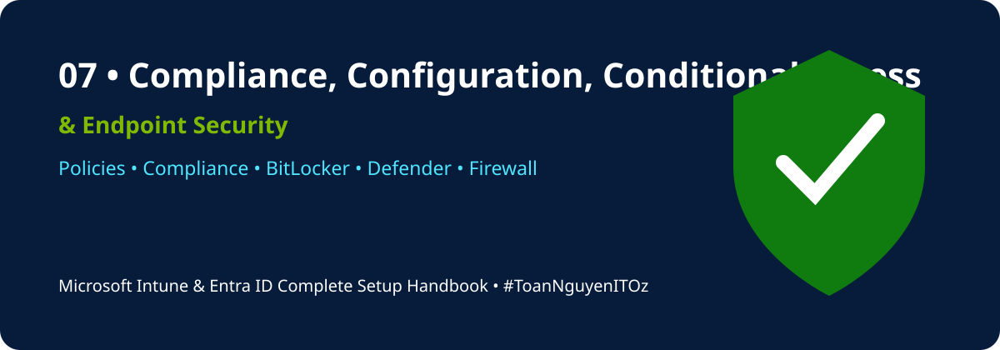

<a id="top"></a>

<!-- HANDBOOK-HEADER:START -->
<div align="center">



[](https://learn.microsoft.com/mem/intune/)
[](https://learn.microsoft.com/entra/identity/)
[](https://learn.microsoft.com/microsoft-365/)
[](../README.md)

[🏠 Handbook Home](../README.md) · [🧪 Labs](../labs/README.md) · [⚡ Scripts](../scripts/README.md) · [📋 Templates](../templates/README.md)

</div>
<!-- HANDBOOK-HEADER:END -->

# 🛡️ Compliance, Configuration, Conditional Access & Endpoint Security

[⬅ Previous](06-device-enrollment-methods.md) · [🏠 Home](../README.md) · [Next ➡](08-apps-updates-reporting.md)

---

## Compliance Policies

Compliance policies evaluate whether devices meet organizational requirements.

Typical settings:

- BitLocker enabled
- Secure Boot enabled
- Firewall enabled
- Antivirus and antispyware active
- Minimum OS version
- Password or PIN complexity
- Device threat level below a defined threshold
- No simple passwords

### Recommended workflow

```text
Create policy → Assign pilot group → Monitor results → Notify users → Add grace period → Enforce with Conditional Access
```

## Actions for Noncompliance

- Mark device noncompliant
- Notify user by email
- Send push notification
- Add grace period
- Remotely lock or retire where justified
- Block access through Conditional Access

## Configuration Profiles

Use:

- Settings Catalog for granular settings
- Administrative Templates for policy-based Windows settings
- Templates for common platform scenarios
- Custom profiles only where built-in settings are unavailable

Common profiles include Wi-Fi, VPN, certificates, OneDrive, Microsoft Edge, Windows Hello for Business, device restrictions, and user experience settings.

## Endpoint Security

Key policy areas:

| Area | Purpose |
|---|---|
| Antivirus | Real-time malware protection |
| Disk encryption | BitLocker and recovery key management |
| Firewall | Inbound and outbound traffic control |
| Attack surface reduction | Reduce risky application and script behavior |
| Account protection | Windows Hello, local users, and group controls |
| Endpoint detection and response | Defender for Endpoint integration |

## Conditional Access

Recommended starter policies:

- Require MFA for administrators
- Require MFA for users
- Block legacy authentication
- Require compliant devices for selected cloud apps
- Protect security information registration
- Apply location or risk controls where licensed

> [!CAUTION]
> Build new Conditional Access policies in report-only mode, exclude emergency access accounts, review sign-in logs, and test with pilot users before enabling.

## Policy Lifecycle

```text
Define requirement
→ Design policy
→ Record dependencies
→ Assign pilot group
→ Monitor reports
→ Remediate failures
→ Expand deployment
→ Review periodically
```

## Validation Checklist

- [ ] Pilot devices evaluate compliance
- [ ] Grace period is appropriate
- [ ] Notifications contain support details
- [ ] Configuration profiles have no conflicts
- [ ] BitLocker keys are escrowed
- [ ] Defender policies are applied
- [ ] Conditional Access tested in report-only mode
- [ ] Emergency access account procedure validated

---

[⬅ Previous](06-device-enrollment-methods.md) · [🏠 Home](../README.md) · [Next ➡](08-apps-updates-reporting.md)

<!-- HANDBOOK-FOOTER:START -->
---

<div align="center">

### 👨‍💻 Xuan Toan Nguyen

**IT Support · Systems Administration · Microsoft 365 · Azure · Modern Workplace**  
📍 Adelaide, South Australia  
🏅 Silver Medalist — WorldSkills Australia SA Regional Competition 2026, Cloud Computing

[](https://www.linkedin.com/in/toan-nguyen-it-oz)
[](https://github.com/toannguyenitoz)
[](https://github.com/toannguyenitoz/microsoft-intune-entra-id-complete-handbook)

**#MicrosoftIntune · #MicrosoftEntraID · #Microsoft365 · #ModernWorkplace · #ToanNguyenITOz**

[⬆ Back to Top](#top) · [🏠 Back to Handbook](../README.md)

</div>
<!-- HANDBOOK-FOOTER:END -->
