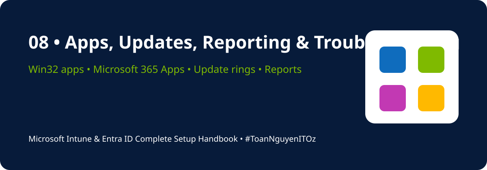

<a id="top"></a>

<!-- HANDBOOK-HEADER:START -->
<div align="center">



[](https://learn.microsoft.com/mem/intune/)
[](https://learn.microsoft.com/entra/identity/)
[](https://learn.microsoft.com/microsoft-365/)
[](../README.md)

[🏠 Handbook Home](../README.md) · [🧪 Labs](../labs/README.md) · [⚡ Scripts](../scripts/README.md) · [📋 Templates](../templates/README.md)

</div>
<!-- HANDBOOK-HEADER:END -->

# 📦 Apps, Updates, Reporting & Troubleshooting

[⬅ Previous](07-compliance-configuration-security.md) · [🏠 Home](../README.md) · [Next ➡](09-final-readiness-checklist.md)

---

## Application Deployment

Intune supports Microsoft 365 Apps, Microsoft Store apps, web links, line-of-business packages, and Win32 applications.

### Win32 deployment workflow

1. Prepare clean source files.
2. Define silent install and uninstall commands.
3. Package content with `IntuneWinAppUtil.exe`.
4. Upload the `.intunewin` file.
5. Configure requirements and detection rules.
6. Add dependencies or supersedence where needed.
7. Assign to a pilot group.
8. Monitor install status and logs.

### Example commands

```powershell
# MSI install
msiexec /i "Application.msi" /qn /norestart

# MSI uninstall
msiexec /x "{PRODUCT-CODE}" /qn /norestart
```

## Scripts and Remediations

Use PowerShell scripts for configuration tasks and Remediations for recurring detection-and-fix scenarios.

Good candidates include:

- Detecting stopped services
- Repairing registry settings
- Removing stale files
- Validating disk space
- Repairing certificates
- Checking security controls

## Windows Updates

Use separate pilot and production rings.

| Policy | Purpose |
|---|---|
| Update rings | Deferrals, deadlines, restart behaviour |
| Feature updates | Control target Windows feature version |
| Quality updates | Expedite or manage monthly security updates |
| Driver updates | Review and approve supported drivers |

## Reporting and Monitoring

Review:

- Device compliance reports
- Configuration profile status
- Application install status
- Windows update reports
- Endpoint security reports
- Enrollment failures
- Entra sign-in and audit logs
- Service health advisories

## Troubleshooting Workflow

```text
Confirm user and device
→ Confirm licence
→ Confirm enrollment and ownership
→ Check assignment and filters
→ Check device sync time
→ Review status and error code
→ Collect local logs
→ Test detection manually
→ Remediate and re-sync
→ Document root cause
```

## Important Windows Logs

```text
C:\ProgramData\Microsoft\IntuneManagementExtension\Logs\IntuneManagementExtension.log
C:\ProgramData\Microsoft\IntuneManagementExtension\Logs\AgentExecutor.log
C:\ProgramData\Microsoft\IntuneManagementExtension\Logs\AppWorkload.log
```

Useful Event Viewer locations:

```text
Applications and Services Logs
└── Microsoft
    └── Windows
        └── DeviceManagement-Enterprise-Diagnostics-Provider
            └── Admin
```

## Common Causes of Failure

- Missing Intune licence
- Incorrect assignment or exclusion
- Requirement rule mismatch
- Detection rule returns the wrong result
- Unsupported install context
- Pending reboot
- Proxy or firewall blocking endpoints
- Device has not recently synced
- Conflicting configuration profiles
- Stale or duplicate device objects

---

[⬅ Previous](07-compliance-configuration-security.md) · [🏠 Home](../README.md) · [Next ➡](09-final-readiness-checklist.md)

<!-- HANDBOOK-FOOTER:START -->
---

<div align="center">

### 👨‍💻 Xuan Toan Nguyen

**IT Support · Systems Administration · Microsoft 365 · Azure · Modern Workplace**  
📍 Adelaide, South Australia  
🏅 Silver Medalist — WorldSkills Australia SA Regional Competition 2026, Cloud Computing

[](https://www.linkedin.com/in/toan-nguyen-it-oz)
[](https://github.com/toannguyenitoz)
[](https://github.com/toannguyenitoz/microsoft-intune-entra-id-complete-handbook)

**#MicrosoftIntune · #MicrosoftEntraID · #Microsoft365 · #ModernWorkplace · #ToanNguyenITOz**

[⬆ Back to Top](#top) · [🏠 Back to Handbook](../README.md)

</div>
<!-- HANDBOOK-FOOTER:END -->
