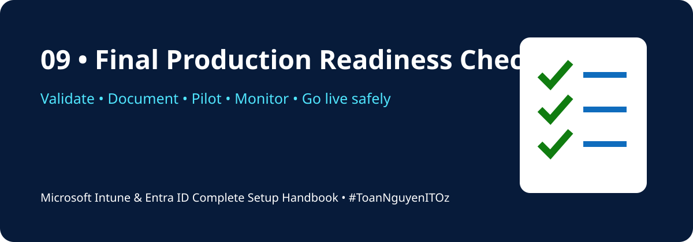

<!-- HANDBOOK-HEADER:START -->

[🏠 Handbook Home](../README.md) · [🧪 Labs](../labs/README.md) · [⚡ Scripts](../scripts/README.md) · [📋 Templates](../templates/README.md)

<!-- HANDBOOK-HEADER:END -->

# ✅ Final Production Readiness Checklist

[⬅ Previous](08-apps-updates-reporting.md) · [🏠 Home](../README.md)

---

## Tenant and Identity

- [ ] Custom domain verified and healthy
- [ ] Emergency access accounts created and tested
- [ ] Administrative accounts separated from daily-use accounts
- [ ] MFA required for privileged roles
- [ ] SSPR configured and tested
- [ ] Guest access and external collaboration reviewed
- [ ] Role assignments documented
- [ ] Licence assignments validated

## Intune Foundation

- [ ] MDM authority confirmed
- [ ] Automatic enrollment scope configured
- [ ] Enrollment restrictions reviewed
- [ ] Device limits defined
- [ ] Company Portal branding and support information configured
- [ ] Pilot groups separated from production groups

## Device Management

- [ ] Enrollment methods documented by platform
- [ ] Ownership is correct for test devices
- [ ] Primary users are correctly assigned
- [ ] Configuration profiles apply successfully
- [ ] Compliance policies evaluate correctly
- [ ] Device cleanup rules are defined

## Security

- [ ] BitLocker configured and recovery keys escrowed
- [ ] Antivirus and firewall policies deployed
- [ ] Attack Surface Reduction tested
- [ ] Conditional Access policies tested in report-only mode
- [ ] Legacy authentication blocked where possible
- [ ] Defender integration validated
- [ ] Security exceptions approved and documented

## Applications

- [ ] Required applications installed on pilot devices
- [ ] Install and uninstall commands tested locally
- [ ] Detection rules validated
- [ ] Dependencies and supersedence documented
- [ ] Assignment intent reviewed
- [ ] User and system contexts confirmed

## Windows Updates

- [ ] Pilot and production update rings created
- [ ] Deferrals and deadlines approved
- [ ] Restart behaviour communicated
- [ ] Feature update target configured
- [ ] Quality update reporting reviewed
- [ ] Rollback and incident process documented

## Operations and Support

- [ ] Service Desk runbook available
- [ ] Enrollment troubleshooting process documented
- [ ] Win32 app troubleshooting process documented
- [ ] Intune Management Extension logs understood
- [ ] Escalation contacts recorded
- [ ] Change records maintained
- [ ] Reports and audit logs reviewed regularly
- [ ] Baseline configuration captured before go-live

## Go-Live Decision

| Area | Owner | Status | Evidence |
|---|---|---|---|
| Identity |  | ⬜ |  |
| Enrollment |  | ⬜ |  |
| Compliance |  | ⬜ |  |
| Conditional Access |  | ⬜ |  |
| Endpoint Security |  | ⬜ |  |
| Applications |  | ⬜ |  |
| Updates |  | ⬜ |  |
| Support Readiness |  | ⬜ |  |

> [!IMPORTANT]
> Go live only after pilot evidence confirms that users can enroll, authenticate, receive required applications, remain compliant, and access business resources without unexpected disruption.

---

**Plan Smart · Pilot First · Deploy Confidently · Operate Securely**

[🏠 Back to Handbook](../README.md) · [⬆ Back to Top](#-final-production-readiness-checklist)

<!-- HANDBOOK-FOOTER:START -->
---

### 👨‍💻 Xuan Toan Nguyen

**IT Support · Systems Administration · Microsoft 365 · Azure · Modern Workplace**  
📍 Adelaide, South Australia  
🏅 Silver Medalist — WorldSkills Australia SA Regional Competition 2026, Cloud Computing

**#MicrosoftIntune · #MicrosoftEntraID · #Microsoft365 · #ModernWorkplace · #ToanNguyenITOz**

[⬆ Back to Top](#top) · [🏠 Back to Handbook](../README.md)

<!-- HANDBOOK-FOOTER:END -->
