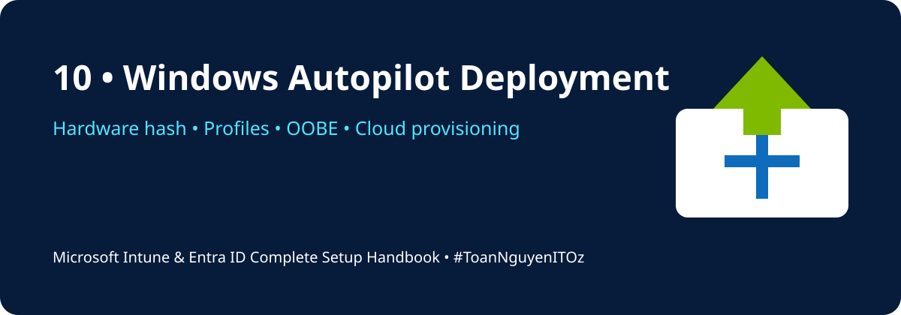

<a id="top"></a>

<!-- HANDBOOK-HEADER:START -->
<div align="center">



[](https://learn.microsoft.com/mem/intune/)
[](https://learn.microsoft.com/entra/identity/)
[](https://learn.microsoft.com/microsoft-365/)
[](../README.md)

[🏠 Handbook Home](../README.md) · [🧪 Labs](../labs/README.md) · [⚡ Scripts](../scripts/README.md) · [📋 Templates](../templates/README.md)

</div>
<!-- HANDBOOK-HEADER:END -->

# 🚀 Windows Autopilot Deployment

[🏠 Home](../README.md)

## Deployment Workflow

1. Confirm licensing and Windows edition.
2. Register the device hardware hash or use OEM registration.
3. Create a dynamic Autopilot device group.
4. Create and assign a deployment profile.
5. Configure Enrollment Status Page.
6. Assign required applications and security policies.
7. Start the device in OOBE and connect to the internet.
8. Sign in with the assigned user.
9. Validate Entra join, Intune enrollment, compliance, apps, and updates.

## Example Dynamic Group Rule

```text
(device.devicePhysicalIDs -any (_ -startsWith "[ZTDId]"))
```

## Recommended Pilot Controls

- User-driven Entra join
- Standard user account
- Skip privacy settings where approved
- Hide change-account options
- Block device use until required policies and apps complete
- Use a dedicated Autopilot pilot group

## Troubleshooting Checklist

- [ ] Device appears under Windows Autopilot devices
- [ ] Profile status is Assigned
- [ ] User has an Intune licence
- [ ] Enrollment restrictions permit Windows enrollment
- [ ] Network can reach required Microsoft endpoints
- [ ] TPM and device time are healthy
- [ ] Enrollment Status Page has not timed out
- [ ] Required app detection rules are correct

Useful command during diagnostics:

```powershell
Get-AutopilotDiagnostics.ps1 -Online
```

> [!TIP]
> A single incorrectly packaged required Win32 app can block the entire Enrollment Status Page. Test required apps independently before adding them to Autopilot.

<!-- HANDBOOK-FOOTER:START -->
---

<div align="center">

### 👨‍💻 Xuan Toan Nguyen

**IT Support · Systems Administration · Microsoft 365 · Azure · Modern Workplace**  
📍 Adelaide, South Australia  
🏅 Silver Medalist — WorldSkills Australia SA Regional Competition 2026, Cloud Computing

[](https://www.linkedin.com/in/toan-nguyen-it-oz)
[](https://github.com/toannguyenitoz)
[](https://github.com/toannguyenitoz/microsoft-intune-entra-id-complete-handbook)

**#MicrosoftIntune · #MicrosoftEntraID · #Microsoft365 · #ModernWorkplace · #ToanNguyenITOz**

[⬆ Back to Top](#top) · [🏠 Back to Handbook](../README.md)

</div>
<!-- HANDBOOK-FOOTER:END -->
