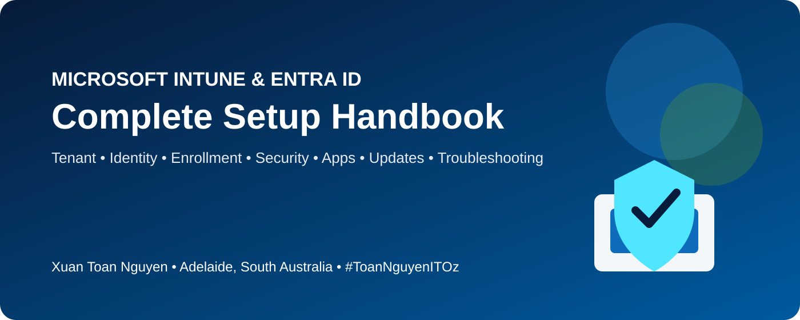

<div align="center">



# 🧪 Hands-on Lab Scenarios

[](../README.md)
[](https://learn.microsoft.com/mem/intune/)
[](https://learn.microsoft.com/entra/identity/)

[🏠 Home](../README.md) · [📚 Handbook](../docs/01-fundamentals-tenant-prerequisites.md) · [⚡ Scripts](../scripts/README.md)

</div>

---

## 🧭 Lab Path

| Lab | Focus | Evidence |
|---|---|---|
| 01 | Tenant discovery | Tenant ID, domains, service health |
| 02 | Custom domain and licensing | DNS verification and licence assignment |
| 03 | Identity and RBAC | Users, guests, groups, roles |
| 04 | MFA and SSPR | Authentication methods and sign-in logs |
| 05 | Windows enrollment | Entra join and Intune enrollment |
| 06 | Configuration and compliance | Policy status and noncompliance actions |
| 07 | Conditional Access | Report-only testing and What If analysis |
| 08 | Win32 application | Packaging, detection, and IME logs |
| 09 | Windows updates | Pilot and production update rings |
| 10 | Troubleshooting challenge | Symptoms, root cause, resolution |

---

## Lab 01 — Tenant Discovery
- Locate tenant ID and default domain
- Identify required admin portals
- Review service health
- Create pilot user and group

## Lab 02 — Custom Domain and Licensing
- Add a test domain
- Verify the TXT record
- Assign a licence through a group
- Validate user sign-in

## Lab 03 — Identity and RBAC
- Create users and guests
- Build assigned and dynamic groups
- Assign Intune Administrator to a group
- Compare role permissions

## Lab 04 — MFA and SSPR
- Configure authentication methods
- Enable SSPR for pilot users
- Build an MFA Conditional Access policy in report-only mode
- Review sign-in logs

## Lab 05 — Windows Enrollment
- Entra join a Windows 11 VM
- Confirm Intune enrollment
- Validate ownership and primary user
- Perform remote sync and restart actions

## Lab 06 — Configuration and Compliance
- Deploy a Settings Catalog profile
- Create a Windows compliance policy
- Configure noncompliance notifications
- Review per-setting status

## Lab 07 — Conditional Access
- Require a compliant device for a test app
- Use report-only mode
- Test compliant and noncompliant access
- Use the What If tool

## Lab 08 — Win32 Application
- Package a utility as `.intunewin`
- Create requirement and detection rules
- Deploy to pilot devices
- Review Intune Management Extension logs

## Lab 09 — Windows Update Rings
- Create pilot and production rings
- Configure deferral, deadline, and restart settings
- Review update reports

## Lab 10 — Troubleshooting Challenge

Introduce one fault at a time: remove a licence, exclude the user from MDM scope, break a detection rule, add conflicting settings, or make a device noncompliant. Capture symptoms, evidence, root cause, resolution, and prevention.

## 📋 Lab Evidence Template

```text
Lab:
Date:
Objective:
Environment:
Steps performed:
Expected result:
Actual result:
Evidence/screenshots:
Issue encountered:
Root cause:
Resolution:
Lessons learned:
```

---

<div align="center">

### 👨‍💻 Xuan Toan Nguyen

IT Support · Systems Administration · Microsoft 365 · Azure · Modern Workplace  
📍 Adelaide, South Australia

[](https://www.linkedin.com/in/toan-nguyen-it-oz)
[](https://github.com/toannguyenitoz)

**#MicrosoftIntune · #MicrosoftEntraID · #ToanNguyenITOz**

[🏠 Home](../README.md) · [⬆ Back to Top](#-hands-on-lab-scenarios)

</div>