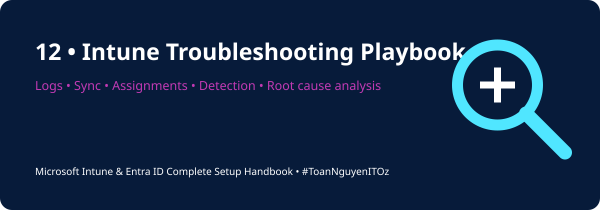

<div align="center">



# ⚡ PowerShell Scripts

[](https://learn.microsoft.com/powershell/)
[](https://learn.microsoft.com/mem/intune/)
[](../README.md)

[🏠 Home](../README.md) · [🧪 Labs](../labs/README.md) · [📋 Templates](../templates/README.md)

</div>

---

## 📘 Overview

This folder contains starter PowerShell tools for local Microsoft Intune and Microsoft Entra troubleshooting. Run scripts in a pilot or lab environment first and review all output before sharing it outside your organization.

## 🧰 Included Scripts

| Script | Purpose | Recommended Context |
|---|---|---|
| `Get-IntuneDeviceDiagnostics.ps1` | Collect join, enrollment, services, events, and IME log information | Run as Administrator during investigation |
| `Test-IntunePrerequisites.ps1` | Validate common local prerequisites before escalation | Pre-enrollment and first-line triage |

## ▶️ Usage

Run PowerShell as Administrator:

```powershell
Set-ExecutionPolicy -Scope Process Bypass
.\Get-IntuneDeviceDiagnostics.ps1 -OutputFolder C:\Temp\IntuneDiagnostics
```

## 🔍 Suggested Investigation Workflow

```text
Confirm user and device
→ Check licence and MDM scope
→ Verify Entra join state
→ Trigger Intune sync
→ Review service status
→ Review DeviceManagement event logs
→ Review IntuneManagementExtension.log
→ Validate policy and app assignments
→ Record root cause and resolution
```

> [!WARNING]
> Diagnostic output can contain usernames, tenant IDs, device IDs, application names, internal URLs, and other organizational information. Sanitize files before attaching them to tickets or publishing examples.

> [!TIP]
> Capture timestamps and timezone information. Correlating local logs with Intune, Entra sign-in, and audit logs is much easier when the time window is precise.

---

<div align="center">

### 👨‍💻 Xuan Toan Nguyen

IT Support · Systems Administration · Microsoft 365 · Azure · Modern Workplace  
📍 Adelaide, South Australia

[](https://www.linkedin.com/in/toan-nguyen-it-oz)
[](https://github.com/toannguyenitoz)

**#PowerShell · #MicrosoftIntune · #MicrosoftEntraID · #ToanNguyenITOz**

[🏠 Home](../README.md) · [⬆ Back to Top](#-powershell-scripts)

</div>